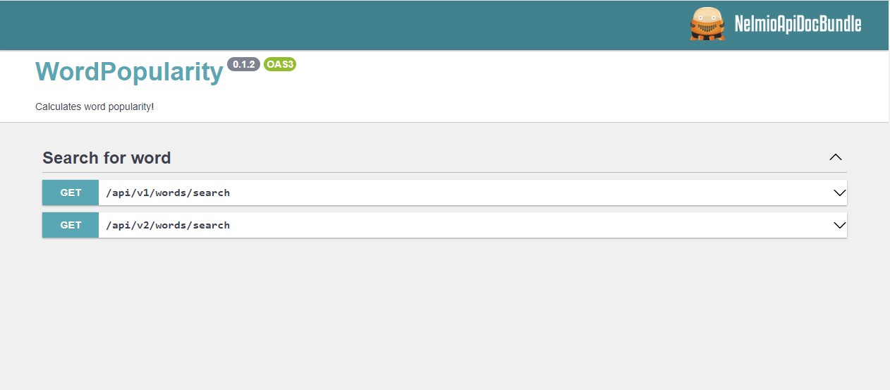

# Task

Create a system that calculates the popularity of a certain word.
For a given word, the system should search for a GitHub issue using the number of results
for ```{word} rocks``` as a positive result and ```{word} sucks``` as a negative.
The result should be a popularity rating of the given word from 0-10 as a ratio of the
positive result to the total number of results. The results should be saved in a local
database so that future queries for the same words are faster.
In the future, the addition/change of providers is expected (e.g. Twitter will be used
instead of GitHub), so the system should be designed accordingly.

## Requirements

- GitHub personal access token - [how to get one](https://github.com/settings/tokens)
------------
## Install instruction w/o docker

- **require** installed *mysql* and *php* (or XAMPP, WAMP, MAMP, LAMP ...)

1. clone the repository
    ```shell
    git clone https://github.com/KrasomirMioc/word_popularity.git
    ```
2. copy .env to .env.local
    ```shell
    cp .env .env.local
    ```
3. insert data into .env.local for DATABASE_URL and GITHUB_TOKEN keys
4. create database
    ```shell
    bin/console doctrine:database:create
    ```
5. create database table
    ```shell
    bin/console doctrine:migrations:migrate
    ```
6. start server
    ```shell
    symfony server:start
    ```
------------
## Install instruction with docker

- **require** installed and running last versions of *docker* and *docker-compose*


- if you haven't done the first three steps so far

1. clone the repository
   ```shell
   git clone https://github.com/KrasomirMioc/word_popularity.git
   ```
2. copy .env to .env.local
   ```shell
   cp .env .env.local
   ```
3. insert data into .env.local for DATABASE_URL and GITHUB_TOKEN keys
4. build your containers with command
   ```shell
   docker-compose up --build      #it might take a while
   ```
5. when build is done, in another terminal open interactive bash shell session inside running container with command
   ```shell
   docker exec -it word_popularity_www bash
   ```
6. inside a container you can proceed with creating a database and db tables
7. create database
   ```shell
   bin/console doctrine:database:create
   ```
8. and db tables
   ```shell
   bin/console doctrine:migrations:migrate
   ```
9. there is no need to start the server, because it's already up and running on
   ```php
   localhost:8741
   ```
10. each subsequent time when you want start the app use command without ```--build``` flag
   ```shell
   docker-compose up
   ```


#### To access phpMyAdmin UI

PhpMyAdmin is available on:

```php
localhost:8000
```
with user: root and without password

#### To access MySql container

use command
```shell
  docker exec -it word_popularity_db bash
```


--------------
## How to use API v1

Go to url and add your word to search:
```php
GET https://127.0.0.1:8000/api/v1/words/search?term={your word to search}
```
- for **docker** user
```php
GET localhost:8741/api/v1/words/search?term={your word to search}
```

- and for the search term *'php'* you will get:
```json
{
  "term": "php",
  "score": 4.97
}
```
- for the search term *'javascript*' you will get:
```json
{
  "term": "javascript",
  "score": 4.66
}
```
- if you search for a word *'maslačak*' you will get:
```json
{
  "term": "maslačak",
  "score": 0
}
```
- if you **don't enter a search word**, you will get:
```json
{
  "message": "Parameter term must be present and can not be empty.",
  "status": 422
}
```
- if you **omit GITHUB_TOKEN**, you wil get:
```json
{
  "status": 401,
  "message": "HTTP/2 401  returned for \"https://api.github.com/search/issues?q={your word}"
}
```
---------------
## How to use API v2

The difference between APIv1 and APIv2 is in the response. APIv2 returns responses according to the JSONAPI specification.

Go to url and add your word to search:
```php
GET https://127.0.0.1:8000/api/v2/words/search?term={your word to search}
```
- for **docker** user
```php
GET localhost:8741/api/v2/words/search?term={your word to search}
```

- and for the search term *'php'* you will get:
```json
{
  "data": {
    "attributes": {
      "score": 4.97,
      "term": "php",
      "positiveCount": 2706,
      "negativeCount": 5450,
      "totalCount": 5078100,
      "source": "github",
      "createdAt": "2023-04-11 18:28:46"
    },
    "data_resource_meta": null,
    "id": "3",
    "relationships": null,
    "type": "word"
  },
  "meta": {},
  "jsonapi": {
    "version": "1.1"
  }
}
```
- for the search term *'javascript*' you will get:
```json
{
  "data": {
    "attributes": {
      "score": 4.66,
      "term": "javascript",
      "positiveCount": 1886,
      "negativeCount": 4047,
      "totalCount": 4915713,
      "source": "github",
      "createdAt": "2023-04-11 19:21:20"
    },
    "data_resource_meta": null,
    "id": "25",
    "relationships": null,
    "type": "word"
  },
  "meta": {},
  "jsonapi": {
    "version": "1.1"
  }
}
```
- if you search for a word *'maslačak*' you will get:
```json
{
  "data": {
    "attributes": {
      "score": 0,
      "term": "maslačak",
      "positiveCount": 0,
      "negativeCount": 0,
      "totalCount": 2,
      "source": "github",
      "createdAt": "2023-04-11 23:38:13"
    },
    "data_resource_meta": null,
    "id": "26",
    "relationships": null,
    "type": "word"
  },
  "meta": {},
  "jsonapi": {
    "version": "1.1"
  }
}
```
- if you **don't enter a search word**, you will get:
```json
{
  "errors": [
    {
      "id": "c1051bb4-d103-4f74-8988-acbcafc7fdc3",
      "links": null,
      "status": "422",
      "code": "c1051bb4-d103-4f74-8988-acbcafc7fdc3",
      "title": "Parameter term must be present and can not be empty.",
      "detail": null,
      "source": null,
      "meta": null
    }
  ],
  "meta": {},
  "jsonapi": {
    "version": "1.1"
  }
}
```
- if you **omit GITHUB_TOKEN** and search for a **previously un searched** word, you wil get:
```json
{
  "errors": [
    {
      "id": null,
      "links": null,
      "status": "401",
      "code": null,
      "title": "HTTP/2 401  returned for \"https://api.github.com/search/issues?q=adonis%2Brocks\".",
      "detail": "{... ful stack trace if in dev mode or null if not ...}",
      "source": null,
      "meta": null
    }
  ],
  "meta": {},
  "jsonapi": {
    "version": "1.1"
  }
}
```
--------------
## How to use OPENAPI UI to test API

To use OPENAPI UI go to:
```php
GET https://127.0.0.1:8000/api/doc
```
- for **docker** user
```php
GET localhost:8741/api/doc
```
and there is two routes for you to test



-------------------
## How to change search provider

> - create a new "provider" class that will implement the existing search provider interface ```App\Interface\SearchProviderInterface.php```
> - in ```services.yaml``` in interfaces section change the registration of the existing provider with a new one
>
> ```diff
> #services.yaml
> 
> #interfaces
> # change this line
> - App\Interface\SearchProviderInterface: '@App\Provider\GitHubProvider'
> # with this line
> + App\Interface\SearchProviderInterface: '@App\Provider\{NewProvider}'
> ```


